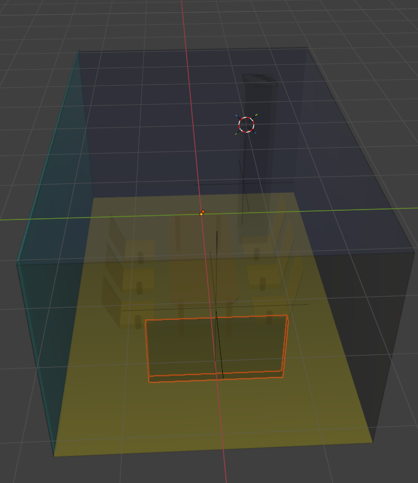

# 6周科研工作流程规划：基于改进 3DGS 的室内无线电磁环境重建

## 一、 当前工作进度汇报 (Current Status)

**总体进度：接近20% (基础仿真环境与数据管线搭建完成)**

*   **✅ 已完成工作 (Completed):**
    1.  **仿真环境搭建**：基于 TensorFlow + Sionna + Mitsuba 完成了光线追踪仿真环境配置。
    2.  **物理场景构建**：修复了 `scene.xml` 的几何闭合问题，并基于 **ITU-R P.2040 标准** 实现了混凝土、木材、金属等材质的自动物理参数映射，确保了仿真的物理真实性。
    3.  **数据生成管线**：成功编写脚本生成带有功率标注的稀疏视点数据集，并已格式化为 COLMAP 标准（Images + Pose + Sparse Points）。
*   **🚧 待解决/进行中 (In Progress):**
    *   **数据物理有效性验证**：正在校验生成的功率值（dBm）分布范围，目前功率都是-180dB,目前还不清楚原因，现在需要消除 -180dB 异常值，确保“真值”数据可靠。
    *   **基线模型接入**：准备将仿真数据接入标准 3DGS 网络进行首轮训练。
    *   **房间的构造可能太简单了**，园项目的房间很复杂，我用blender自己建模的房间可能太简单了，如图需要加入更多的家具。

---

## 二、 6周详细工作流程 (Weekly Workflow)

本阶段核心目标：在标准 3DGS 基础上，**引入“少样本学习 (SparseGS)”与“模型压缩 (Compact3DGS)”策略**，解决无线电测量点稀疏及模型轻量化痛点。这段流程参考了您之前给我的3DGS创新方向的材料，这些流程中的内容以我的能不一定都可以完成，但是是可以作为参考的。

### 准备工作 读论文
    我需要把第三部分的关键改进技术的相关论文都读一遍，尽可能理解。

### 📅 第 1 周：数据验证与“少样本”基准建立
> **目标**：完成数据清洗，并模拟真实场景中的“稀疏采样”挑战。

*   **1.1 数据集完备化**：
    *   基于修复后的 Sionna 代码，生成多组高密度“真值”数据集（作为 Ground Truth）。
    *   **模拟少样本场景**：从完整数据集中随机抽取 **5% - 10%** 的数据作为训练集，验证标准 3DGS 在数据稀疏时产生的崩塌现象（如伪影、几何结构丢失），为引入 SparseGS 做铺垫。
*   **1.2 引入深度/几何先验 (对应 SparseGS)**：
    *   利用 Sionna 场景中的 `.ply` 模型信息，提取深度图（Depth Map）或点云几何信息。
    *   **关键动作**：将几何深度信息作为“几何约束”加入到数据预处理流程中。

### 📅 第 2 周：算法改进核心——引入几何正则化
> **目标**：复现并改进 SparseGS 策略，解决数据不足导致的重建失败。

*   **2.1 深度一致性损失 (Depth Consistency Loss)**：
    *   **参考策略**：参考 *SparseGS (Xiong et al., 2023)*。
    *   **创新迁移**：无线电信号看不见摸不着，且采样极少。我们将利用 `scene.xml` 导出的确切几何结构来约束 3D 高斯的生长位置，**强制高斯球附着在物理表面（墙壁、桌子）附近**，防止其在空域漂浮。
*   **2.2 训练与调试**：
    *   在仅使用 10-20 张图片（或采样点）的情况下训练改进后的模型。
    *   对比标准 3DGS，验证是否消除了“漂浮伪影”并提升了信号预测的连续性。

### 📅 第 3 周：模型轻量化与压缩优化
> **目标**：引入 Compact3DGS 思想，降低显存占用，适配移动端部署。

*   **3.1 剪枝策略 (Pruning)**：
    *   **参考策略**：参考 *Compact3DGS (Lee et al., 2024)*。
    *   **实施**：分析训练好的高斯球，移除那些不透明度（Opacity）极低或体积过小、对信号功率贡献可忽略的高斯球。
*   **3.2 矢量量化 (Vector Quantization)**：
    *   尝试对高斯球的颜色/功率系数（SH coefficients）进行 **K-means 聚类量化**。
    *   **预期结果**：将模型体积从几百 MB 压缩至几十 MB，便于未来在嵌入式设备或无人机上运行。

### 📅 第 4 周：场景扩展性与编辑能力测试 (可选探索)
> **目标**：基于 GaussianEditor 思想，探索场景变动的快速适应能力。

*   **4.1 动态场景测试**：
    *   在 Sionna 中移动发射机 (TX) 或改变桌椅位置，生成新数据。
    *   **增量更新**：尝试不从头训练，而是基于第 2 周的模型，利用 *GaussianEditor (Wang et al., 2024)* 的局部更新策略，仅微调变化区域的高斯球。
*   **4.2 消融实验 (Ablation Study)**：
    *   验证“几何正则化”模块和“压缩”模块分别带来了多少性能提升/下降。

### 📅 第 5 周：综合评估与可视化
> **目标**：产出高质量图表，证明方法优越性。

*   **5.1 定量评估**：
    *   计算 **RMSE (均方根误差)**：预测功率 vs Sionna 真值。
    *   计算 **SSIM/PSNR**：热力图的图像结构相似度。
    *   **关键图表**：绘制 **“采样数量 (5%, 10%, 20%) vs 预测精度”曲线**，证明本方法在少样本条件下显著优于 Baseline。
*   **5.2 可视化展示**：
    *   生成特定高度（如 Z=1.5m）的切片热力图。
    *   生成 **Error Map (误差分布图)**，直观展示预测准确的区域。

### 📅 第 6 周：论文撰写与终稿润色
> **目标**：完成学术论文初稿。

*   **6.1 撰写方法论 (Methodology)**：
    *   重点描述如何将 **SparseGS 的深度先验** 转化为 **无线电环境的几何先验**。
    *   描述基于 Compact3DGS 的模型压缩流程。
*   **6.2 撰写实验部分 (Experiments)**：
    *   整理 Sionna 仿真参数、对比实验表格。
*   **6.3 摘要与引言**：
    *   强调痛点：传统射线追踪慢、实地测量成本高（少样本需求）。
    *   强调贡献：提出了一种**基于几何先验的少样本轻量化 3DGS 无线电制图方法**。

---

## 三、 拟采用的关键改进技术 (Technical Innovations)

本项目将重点融合以下文献中的算法优化方向，以适应无线电制图的特殊需求：

| 改进方向 | 参考来源 | 在本项目中的应用 |
| :--- | :--- | :--- |
| **少样本学习** (Few-shot Learning) | *SparseGS: Real-time 360 sparse view synthesis using gaussian splatting (Xiong et al., 2023)* | **核心创新点**。解决无线电测量工作量大的痛点。通过引入 Sionna 场景的几何深度先验，在仅有少量采样点的情况下，约束高斯球分布，防止过拟合，实现高质量重建。 |
| **压缩与量化** (Compression) | *Compact 3D Gaussian representation for radiance field (Lee et al., 2024)* | **工程价值点**。无线电地图常需部署在边缘端。通过剪枝无效高斯球和参数量化，大幅降低显存占用和存储体积。 |
| **实时编辑** (Real-time Editing) | *GaussianEditor: Editing 3d gaussians delicately with text instructions (Wang et al., 2024)* | **探索方向**。借鉴其局部更新思想，当室内家具移动时，仅更新受影响区域的高斯球，实现环境动态感知。 |
